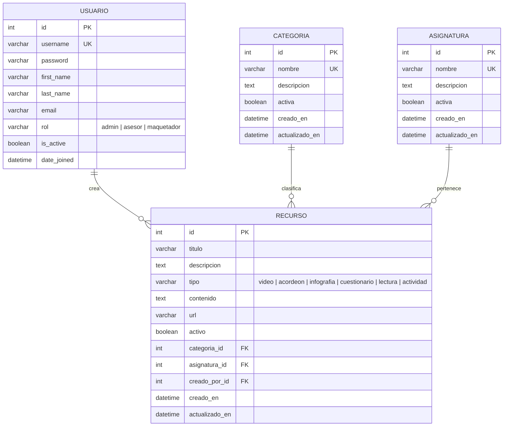

# Diagrama Entidad-Relación (DER) — EduTools

## Descripción General

El modelo de datos de EduTools se compone de cuatro entidades principales que permiten
gestionar el repositorio de recursos pedagógicos, clasificarlos por asignatura y
controlar el acceso por roles:

- **Usuario**: Extiende el modelo de autenticación de Django con un campo de rol
  (Administrador, Asesor Pedagógico, Maquetador).
- **Categoria**: Clasifica los componentes por categoría principal
  (Llamados a la Acción CTA, Estándares de Diseño, Recursos Multimedia, etc.).
- **Asignatura**: Organiza los recursos por materia académica
  (Matemáticas Avanzadas, Historia Universal, Química Orgánica, Programación III).
- **Recurso**: Representa un componente pedagógico creado desde el Sandbox,
  vinculado a una categoría, una asignatura y un usuario creador.

---

## Diagrama Entidad-Relación (Mermaid)

---

## Modelo Relacional

### Tabla: `api_usuario`
| Campo         | Tipo           | Restricciones                        |
|---------------|----------------|--------------------------------------|
| `id`          | INT            | PK, AUTO_INCREMENT                   |
| `username`    | VARCHAR(150)   | UNIQUE, NOT NULL                     |
| `password`    | VARCHAR(128)   | NOT NULL                             |
| `first_name`  | VARCHAR(150)   |                                      |
| `last_name`   | VARCHAR(150)   |                                      |
| `email`       | VARCHAR(254)   |                                      |
| `rol`         | VARCHAR(20)    | NOT NULL, DEFAULT 'asesor'           |
| `is_active`   | BOOLEAN        | DEFAULT TRUE                         |
| `is_staff`    | BOOLEAN        | DEFAULT FALSE                        |
| `is_superuser`| BOOLEAN        | DEFAULT FALSE                        |
| `date_joined` | DATETIME       | AUTO                                 |
| `last_login`  | DATETIME       | NULL                                 |

### Tabla: `api_categoria`
| Campo           | Tipo         | Restricciones                      |
|-----------------|--------------|------------------------------------|
| `id`            | INT          | PK, AUTO_INCREMENT                 |
| `nombre`        | VARCHAR(100) | UNIQUE, NOT NULL                   |
| `descripcion`   | TEXT         |                                    |
| `activa`        | BOOLEAN      | DEFAULT TRUE                       |
| `creado_en`     | DATETIME     | AUTO (creación)                    |
| `actualizado_en`| DATETIME     | AUTO (actualización)               |

### Tabla: `api_asignatura`
| Campo           | Tipo         | Restricciones                      |
|-----------------|--------------|------------------------------------|
| `id`            | INT          | PK, AUTO_INCREMENT                 |
| `nombre`        | VARCHAR(100) | UNIQUE, NOT NULL                   |
| `descripcion`   | TEXT         |                                    |
| `activa`        | BOOLEAN      | DEFAULT TRUE                       |
| `creado_en`     | DATETIME     | AUTO (creación)                    |
| `actualizado_en`| DATETIME     | AUTO (actualización)               |

### Tabla: `api_recurso`
| Campo           | Tipo         | Restricciones                      |
|-----------------|--------------|------------------------------------|
| `id`            | INT          | PK, AUTO_INCREMENT                 |
| `titulo`        | VARCHAR(200) | NOT NULL                           |
| `descripcion`   | TEXT         |                                    |
| `tipo`          | VARCHAR(20)  | NOT NULL, DEFAULT 'video'          |
| `contenido`     | TEXT         |                                    |
| `url`           | VARCHAR(200) |                                    |
| `activo`        | BOOLEAN      | DEFAULT TRUE                       |
| `categoria_id`  | INT          | FK → `api_categoria(id)`, PROTECT  |
| `asignatura_id` | INT          | FK → `api_asignatura(id)`, PROTECT |
| `creado_por_id` | INT          | FK → `api_usuario(id)`, CASCADE    |
| `creado_en`     | DATETIME     | AUTO (creación)                    |
| `actualizado_en`| DATETIME     | AUTO (actualización)               |

---

## Relaciones

| Relación                       | Cardinalidad | Descripción                                       |
|--------------------------------|:------------:|---------------------------------------------------|
| `USUARIO` → `RECURSO`         | 1:N          | Un usuario puede crear muchos recursos.           |
| `CATEGORIA` → `RECURSO`       | 1:N          | Una categoría agrupa muchos recursos.             |
| `ASIGNATURA` → `RECURSO`      | 1:N          | Una asignatura tiene muchos recursos asociados.   |

### Reglas de integridad referencial:
- **`categoria_id`** usa `ON DELETE PROTECT`: No se puede eliminar una categoría que tenga recursos asociados.
- **`asignatura_id`** usa `ON DELETE PROTECT`: No se puede eliminar una asignatura que tenga recursos asociados.
- **`creado_por_id`** usa `ON DELETE CASCADE`: Si se elimina un usuario, se eliminan sus recursos.
