# Diagrama Entidad-Relación — Notación Chen
## Proyecto: EduTools — Gestión y Sandbox Pedagógico

> **Nota metodológica:** Este diagrama sigue la **Notación Chen** (1976), donde:
> - Los **rectángulos** representan Entidades.
> - Los **óvalos/elipses** representan Atributos (subrayados si son clave primaria).
> - Los **rombos** representan Relaciones entre entidades.
> - Las líneas con cardinalidades (1, N) expresan la participación mínima/máxima.

---

## Diagrama DER — Notación Chen (Mermaid)

```mermaid
graph TB
    %% ─── ESTILOS ───────────────────────────────────────────────
    classDef entidad    fill:#003761,stroke:#006972,color:#fff,rx:0
    classDef atributo   fill:#1a5276,stroke:#85c1e9,color:#fff,rx:50
    classDef atribPK    fill:#006972,stroke:#85c1e9,color:#fff,rx:50
    classDef relacion   fill:#154360,stroke:#85c1e9,color:#fff,shape:diamond
    classDef cardLabel  fill:none,stroke:none,color:#aaa,font-size:11px

    %% ═══════════════════════════════════════════════════════════
    %% ENTIDAD: USUARIO
    %% ═══════════════════════════════════════════════════════════
    E_USUARIO["USUARIO"]:::entidad

    A_USU_ID(["<u>id</u>"]):::atribPK
    A_USU_USERNAME(["username"]):::atributo
    A_USU_PASSWORD(["password"]):::atributo
    A_USU_FNAME(["first_name"]):::atributo
    A_USU_LNAME(["last_name"]):::atributo
    A_USU_EMAIL(["email"]):::atributo
    A_USU_ROL(["rol {admin|asesor|maquetador}"]):::atributo
    A_USU_ACTIVE(["is_active"]):::atributo
    A_USU_JOINED(["date_joined"]):::atributo

    E_USUARIO --- A_USU_ID
    E_USUARIO --- A_USU_USERNAME
    E_USUARIO --- A_USU_PASSWORD
    E_USUARIO --- A_USU_FNAME
    E_USUARIO --- A_USU_LNAME
    E_USUARIO --- A_USU_EMAIL
    E_USUARIO --- A_USU_ROL
    E_USUARIO --- A_USU_ACTIVE
    E_USUARIO --- A_USU_JOINED

    %% ═══════════════════════════════════════════════════════════
    %% ENTIDAD: CATEGORIA
    %% ═══════════════════════════════════════════════════════════
    E_CATEGORIA["CATEGORIA"]:::entidad

    A_CAT_ID(["<u>id</u>"]):::atribPK
    A_CAT_NOMBRE(["nombre"]):::atributo
    A_CAT_DESC(["descripcion"]):::atributo
    A_CAT_ACTIVA(["activa"]):::atributo
    A_CAT_CREADO(["creado_en"]):::atributo
    A_CAT_ACTUALIZ(["actualizado_en"]):::atributo

    E_CATEGORIA --- A_CAT_ID
    E_CATEGORIA --- A_CAT_NOMBRE
    E_CATEGORIA --- A_CAT_DESC
    E_CATEGORIA --- A_CAT_ACTIVA
    E_CATEGORIA --- A_CAT_CREADO
    E_CATEGORIA --- A_CAT_ACTUALIZ

    %% ═══════════════════════════════════════════════════════════
    %% ENTIDAD: ASIGNATURA
    %% ═══════════════════════════════════════════════════════════
    E_ASIGNATURA["ASIGNATURA"]:::entidad

    A_ASI_ID(["<u>id</u>"]):::atribPK
    A_ASI_NOMBRE(["nombre"]):::atributo
    A_ASI_DESC(["descripcion"]):::atributo
    A_ASI_ACTIVA(["activa"]):::atributo
    A_ASI_CREADO(["creado_en"]):::atributo
    A_ASI_ACTUALIZ(["actualizado_en"]):::atributo

    E_ASIGNATURA --- A_ASI_ID
    E_ASIGNATURA --- A_ASI_NOMBRE
    E_ASIGNATURA --- A_ASI_DESC
    E_ASIGNATURA --- A_ASI_ACTIVA
    E_ASIGNATURA --- A_ASI_CREADO
    E_ASIGNATURA --- A_ASI_ACTUALIZ

    %% ═══════════════════════════════════════════════════════════
    %% ENTIDAD: RECURSO
    %% ═══════════════════════════════════════════════════════════
    E_RECURSO["RECURSO"]:::entidad

    A_REC_ID(["<u>id</u>"]):::atribPK
    A_REC_TITULO(["titulo"]):::atributo
    A_REC_DESC(["descripcion"]):::atributo
    A_REC_TIPO(["tipo {video|acordeon|infografia|...}"]):::atributo
    A_REC_CONTENIDO(["contenido"]):::atributo
    A_REC_URL(["url"]):::atributo
    A_REC_ACTIVO(["activo"]):::atributo
    A_REC_CREADO(["creado_en"]):::atributo
    A_REC_ACTUALIZ(["actualizado_en"]):::atributo

    E_RECURSO --- A_REC_ID
    E_RECURSO --- A_REC_TITULO
    E_RECURSO --- A_REC_DESC
    E_RECURSO --- A_REC_TIPO
    E_RECURSO --- A_REC_CONTENIDO
    E_RECURSO --- A_REC_URL
    E_RECURSO --- A_REC_ACTIVO
    E_RECURSO --- A_REC_CREADO
    E_RECURSO --- A_REC_ACTUALIZ

    %% ═══════════════════════════════════════════════════════════
    %% RELACIONES (Rombos — Notación Chen)
    %% ═══════════════════════════════════════════════════════════
    R_CREA{{"CREA"}}:::relacion
    R_CLASIFICA{{"CLASIFICA"}}:::relacion
    R_PERTENECE{{"PERTENECE"}}:::relacion

    %% Relación: USUARIO (1) ──CREA──> (N) RECURSO
    E_USUARIO  -- "1" --- R_CREA
    R_CREA     -- "N" --- E_RECURSO

    %% Relación: CATEGORIA (1) ──CLASIFICA──> (N) RECURSO
    E_CATEGORIA -- "1" --- R_CLASIFICA
    R_CLASIFICA  -- "N" --- E_RECURSO

    %% Relación: ASIGNATURA (1) ──PERTENECE──> (N) RECURSO
    E_ASIGNATURA -- "1" --- R_PERTENECE
    R_PERTENECE  -- "N" --- E_RECURSO
```

---

## Descripción de Entidades y Atributos

### 🟦 USUARIO
Extiende el modelo `AbstractUser` de Django. Representa a cualquier persona que interactúa con el sistema.

| Atributo | Tipo | Descripción |
|---|---|---|
| **<u>id</u>** | INT (PK) | Identificador único autoincremental |
| username | VARCHAR(150) | Nombre de usuario único |
| password | VARCHAR(128) | Contraseña hasheada |
| first_name | VARCHAR(150) | Nombre |
| last_name | VARCHAR(150) | Apellido |
| email | VARCHAR(254) | Correo electrónico |
| rol | VARCHAR(20) | `admin` \| `asesor` \| `maquetador` |
| is_active | BOOLEAN | Estado activo/inactivo |
| date_joined | DATETIME | Fecha de alta en el sistema |

### 🟦 CATEGORIA
Clasificación principal de los componentes pedagógicos. Un recurso siempre pertenece a exactamente una categoría.

| Atributo | Tipo | Descripción |
|---|---|---|
| **<u>id</u>** | INT (PK) | Identificador único |
| nombre | VARCHAR(100) | Nombre único de la categoría |
| descripcion | TEXT | Descripción de la categoría |
| activa | BOOLEAN | Si la categoría está activa |
| creado_en | DATETIME | Timestamp de creación |
| actualizado_en | DATETIME | Timestamp de última modificación |

### 🟦 ASIGNATURA
Materia académica asociada a cada recurso pedagógico para organizar el contenido por área de conocimiento.

| Atributo | Tipo | Descripción |
|---|---|---|
| **<u>id</u>** | INT (PK) | Identificador único |
| nombre | VARCHAR(100) | Nombre único de la asignatura |
| descripcion | TEXT | Descripción de la materia |
| activa | BOOLEAN | Si la asignatura está activa |
| creado_en | DATETIME | Timestamp de creación |
| actualizado_en | DATETIME | Timestamp de última modificación |

### 🟦 RECURSO
Entidad central del sistema. Representa un componente pedagógico interactivo creado desde el Sandbox.

| Atributo | Tipo | Descripción |
|---|---|---|
| **<u>id</u>** | INT (PK) | Identificador único |
| titulo | VARCHAR(200) | Título del recurso |
| descripcion | TEXT | Descripción del recurso |
| tipo | VARCHAR(20) | `video` \| `acordeon` \| `infografia` \| `cuestionario` \| `lectura` \| `actividad` |
| contenido | TEXT | HTML o texto del contenido |
| url | VARCHAR(200) | Enlace de destino |
| activo | BOOLEAN | Estado activo/inactivo |
| creado_en | DATETIME | Timestamp de creación |
| actualizado_en | DATETIME | Timestamp de última modificación |

---

## Relaciones (Notación Chen)

| Rombo | Entidades | Cardinalidad | Semántica |
|---|---|:---:|---|
| **CREA** | USUARIO → RECURSO | 1 : N | Un usuario puede crear muchos recursos. Un recurso es creado por exactamente un usuario. |
| **CLASIFICA** | CATEGORIA → RECURSO | 1 : N | Una categoría agrupa muchos recursos. Un recurso pertenece a exactamente una categoría. |
| **PERTENECE** | ASIGNATURA → RECURSO | 1 : N | Una asignatura tiene muchos recursos. Un recurso es de exactamente una asignatura. |

---

> 📎 Ver también: [Modelo Relacional](modelo_relacional.md) | [Script SQL](sql/script_database.sql)
