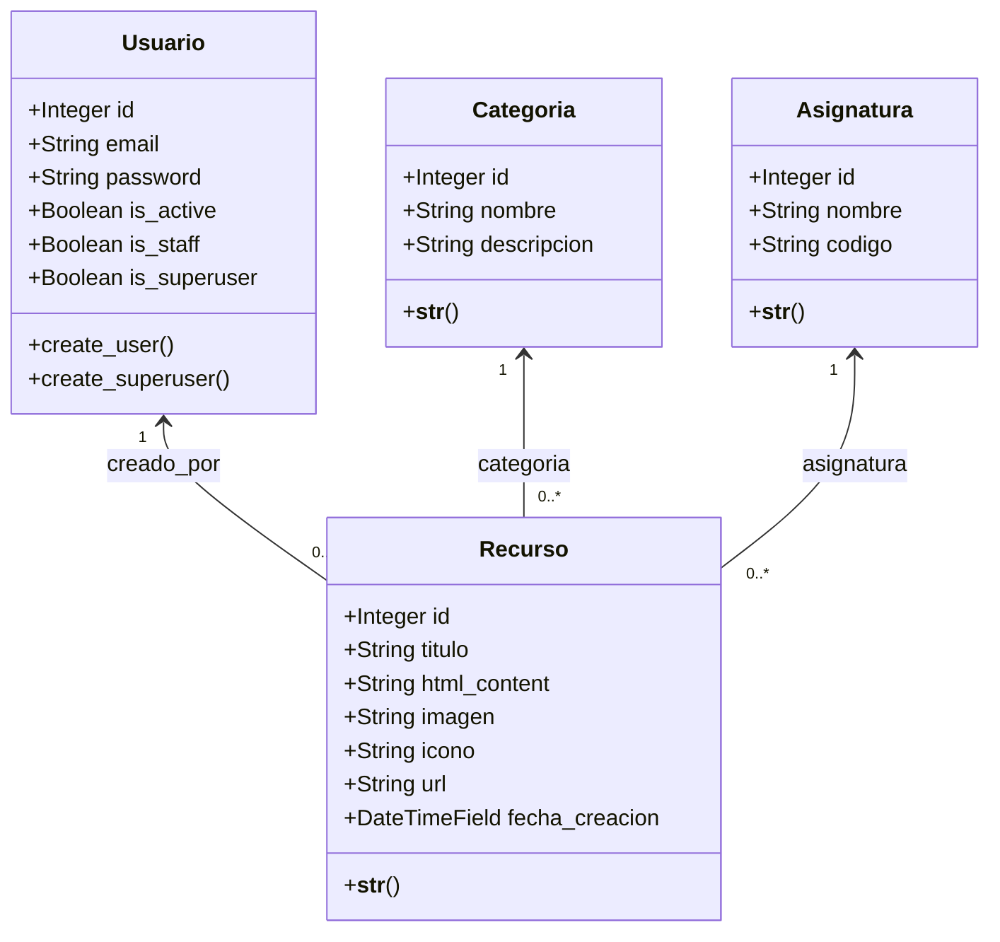

# Diagrama de Clases (Mermaid UML)

El siguiente diagrama de clases representa la estructura de modelos y relaciones implementadas en el Backend (Django).

```mermaid
classDiagram
    %% Modelos de la App 'users'
    class Usuario {
        +Integer id
        +String email
        +String password
        +Boolean is_active
        +Boolean is_staff
        +Boolean is_superuser
        +create_user()
        +create_superuser()
    }

    %% Modelos de la App 'pedagogia'
    class Categoria {
        +Integer id
        +String nombre
        +String descripcion
        +__str__()
    }

    class Asignatura {
        +Integer id
        +String nombre
        +String codigo
        +__str__()
    }

    class Recurso {
        +Integer id
        +String titulo
        +String html_content
        +String imagen
        +String icono
        +String url
        +DateTimeField fecha_creacion
        +__str__()
    }

    %% Relaciones (Foreign Keys)
    Usuario "1" <-- "0..*" Recurso : creado_por
    Categoria "1" <-- "0..*" Recurso : categoria
    Asignatura "1" <-- "0..*" Recurso : asignatura
```
