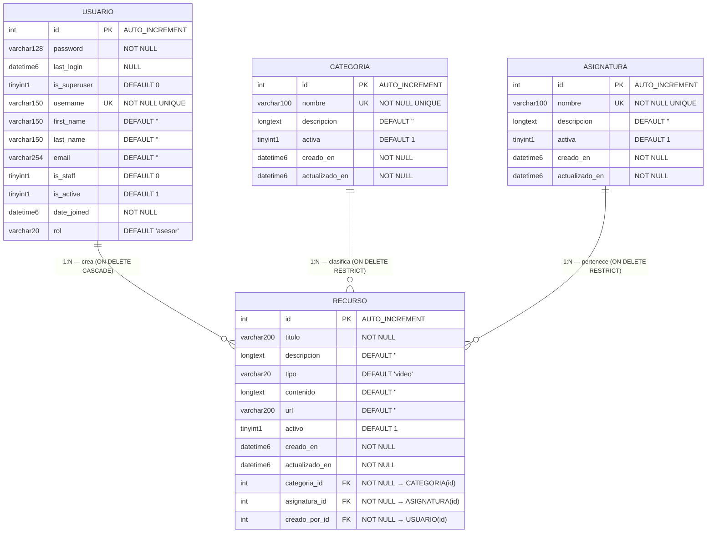

# Modelo Relacional — EduTools
## Proyecto: EduTools — Gestión y Sandbox Pedagógico

> **Nota metodológica:** El **Modelo Relacional** es la traducción formal del DER a tablas relacionales. Muestra las tablas físicas, los tipos de datos exactos del motor MySQL 8.x, las claves primarias (PK), claves foráneas (FK), restricciones de integridad y cardinalidades. Es la fuente de verdad para el script DDL.
>
> 📎 Ver también: [DER Notación Chen](der_chen.md) | [Script SQL](sql/script_database.sql)

---

## Diagrama del Modelo Relacional (Mermaid erDiagram)

---

## Definición de Tablas

### Tabla `api_usuario`
*(Mapea el modelo Django `Usuario(AbstractUser)`)*

| Campo | Tipo MySQL | Restricciones | Descripción |
|---|---|---|---|
| `id` | `INT` | `PK, AUTO_INCREMENT` | Identificador único |
| `password` | `VARCHAR(128)` | `NOT NULL` | Contraseña hasheada por Django |
| `last_login` | `DATETIME(6)` | `NULL` | Último inicio de sesión |
| `is_superuser` | `TINYINT(1)` | `DEFAULT 0` | Superusuario Django Admin |
| `username` | `VARCHAR(150)` | `UNIQUE, NOT NULL` | Nombre de usuario único |
| `first_name` | `VARCHAR(150)` | `DEFAULT ''` | Nombre |
| `last_name` | `VARCHAR(150)` | `DEFAULT ''` | Apellido |
| `email` | `VARCHAR(254)` | `DEFAULT ''` | Correo electrónico |
| `is_staff` | `TINYINT(1)` | `DEFAULT 0` | Acceso al panel Admin |
| `is_active` | `TINYINT(1)` | `DEFAULT 1` | Cuenta activa |
| `date_joined` | `DATETIME(6)` | `NOT NULL` | Fecha de registro |
| `rol` | `VARCHAR(20)` | `NOT NULL, DEFAULT 'asesor'` | Rol del sistema: `admin` \| `asesor` \| `maquetador` |

---

### Tabla `api_categoria`
*(Mapea el modelo Django `Categoria`)*

| Campo | Tipo MySQL | Restricciones | Descripción |
|---|---|---|---|
| `id` | `INT` | `PK, AUTO_INCREMENT` | Identificador único |
| `nombre` | `VARCHAR(100)` | `UNIQUE, NOT NULL` | Nombre de la categoría |
| `descripcion` | `LONGTEXT` | `DEFAULT ''` | Descripción extendida |
| `activa` | `TINYINT(1)` | `DEFAULT 1` | Visibilidad en el sistema |
| `creado_en` | `DATETIME(6)` | `NOT NULL, auto_now_add` | Timestamp de alta |
| `actualizado_en` | `DATETIME(6)` | `NOT NULL, auto_now` | Timestamp de última edición |

**Datos iniciales cargados:**
- Llamados a la Acción (CTA)
- Estándares de Diseño
- Recursos Multimedia
- Herramientas Interactivas
- Evaluaciones

---

### Tabla `api_asignatura`
*(Mapea el modelo Django `Asignatura`)*

| Campo | Tipo MySQL | Restricciones | Descripción |
|---|---|---|---|
| `id` | `INT` | `PK, AUTO_INCREMENT` | Identificador único |
| `nombre` | `VARCHAR(100)` | `UNIQUE, NOT NULL` | Nombre de la asignatura |
| `descripcion` | `LONGTEXT` | `DEFAULT ''` | Descripción de la materia |
| `activa` | `TINYINT(1)` | `DEFAULT 1` | Visibilidad en el sistema |
| `creado_en` | `DATETIME(6)` | `NOT NULL, auto_now_add` | Timestamp de alta |
| `actualizado_en` | `DATETIME(6)` | `NOT NULL, auto_now` | Timestamp de última edición |

**Datos iniciales cargados:**
- Matemáticas Avanzadas
- Historia Universal
- Química Orgánica
- Programación III

---

### Tabla `api_recurso`
*(Mapea el modelo Django `Recurso`)*

| Campo | Tipo MySQL | Restricciones | Descripción |
|---|---|---|---|
| `id` | `INT` | `PK, AUTO_INCREMENT` | Identificador único |
| `titulo` | `VARCHAR(200)` | `NOT NULL` | Título del recurso |
| `descripcion` | `LONGTEXT` | `DEFAULT ''` | Descripción del recurso |
| `tipo` | `VARCHAR(20)` | `NOT NULL, DEFAULT 'video'` | Tipo: `video` \| `acordeon` \| `infografia` \| `cuestionario` \| `lectura` \| `actividad` |
| `contenido` | `LONGTEXT` | `DEFAULT ''` | HTML o texto del componente |
| `url` | `VARCHAR(200)` | `DEFAULT ''` | Enlace externo del recurso |
| `activo` | `TINYINT(1)` | `DEFAULT 1` | Estado de visibilidad |
| `creado_en` | `DATETIME(6)` | `NOT NULL, auto_now_add` | Timestamp de alta |
| `actualizado_en` | `DATETIME(6)` | `NOT NULL, auto_now` | Timestamp de última edición |
| `categoria_id` | `INT` | `FK, NOT NULL` | → `api_categoria(id)` |
| `asignatura_id` | `INT` | `FK, NOT NULL` | → `api_asignatura(id)` |
| `creado_por_id` | `INT` | `FK, NOT NULL` | → `api_usuario(id)` |

---

## Restricciones de Integridad Referencial

| FK en `api_recurso` | Referencia | ON DELETE | ON UPDATE | Justificación |
|---|---|:---:|:---:|---|
| `categoria_id` | `api_categoria(id)` | `RESTRICT` | `CASCADE` | Protege categorías que tienen recursos activos asociados |
| `asignatura_id` | `api_asignatura(id)` | `RESTRICT` | `CASCADE` | Protege asignaturas que tienen recursos activos asociados |
| `creado_por_id` | `api_usuario(id)` | `CASCADE` | `CASCADE` | Si se elimina un usuario, se eliminan todos sus recursos |

---

## Índices de la Tabla `api_recurso`

| Índice | Campo | Propósito |
|---|---|---|
| `idx_recurso_tipo` | `tipo` | Filtrado rápido por tipo de componente |
| `idx_recurso_categoria` | `categoria_id` | Filtrado por categoría en la biblioteca |
| `idx_recurso_asignatura` | `asignatura_id` | Filtrado por asignatura en la biblioteca |
| `idx_recurso_creado_por` | `creado_por_id` | Consultas de recursos por usuario |
| `idx_recurso_creado_en` | `creado_en` | Ordenamiento cronológico descendente |

---

## Validación: Modelo Django ↔ Script SQL ↔ DER

| Entidad | Model Django ✅ | Script SQL ✅ | DER Chen ✅ | Observaciones |
|---|:---:|:---:|:---:|---|
| Usuario | ✅ | ✅ | ✅ | AbstractUser + campo `rol` |
| Categoria | ✅ | ✅ | ✅ | Totalmente sincronizado |
| Asignatura | ✅ | ✅ | ✅ | Totalmente sincronizado |
| Recurso | ✅ | ✅ | ✅ | 3 FK correctas con restricciones |
| FK categoria\_id | ✅ PROTECT | ✅ RESTRICT | ✅ 1:N | Equivalentes en Django/MySQL |
| FK asignatura\_id | ✅ PROTECT | ✅ RESTRICT | ✅ 1:N | Equivalentes en Django/MySQL |
| FK creado\_por\_id | ✅ CASCADE | ✅ CASCADE | ✅ 1:N | Equivalentes en Django/MySQL |

> ✅ **Validación exitosa:** El modelo de datos está completamente sincronizado entre el código Django, el script SQL y la documentación del DER.

---

> 🗓️ **Próximo Sprint:** Este modelo será complementado con el **Diagrama de Clases UML** para documentar la capa de lógica de negocio (serializers, viewsets, servicios Angular).
